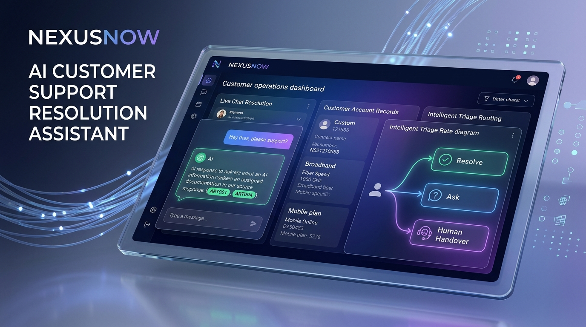

TRACK_ID=PS04

# CSR Assistant — Customer Support Resolution Assistant



An AI-powered support desk assistant for a broadband and mobile provider. It triages incoming customer requests using the conversation history, customer account records, and a knowledge base of support articles — resolving routine cases, asking targeted follow-up questions, or escalating complex cases to human agents with a full context handover.

## What It Does

- **Resolves** routine billing, connection, and plan queries grounded in KB articles (with citations)
- **Asks** for exactly what's missing when information is incomplete — no more, no less
- **Escalates** complex, high-dispute, or uncertain cases to a human agent with a concise handover summary (issue, what's established, what's been tried) so the customer never repeats themselves

## Quick Start (One Command)

### 1. Set your Gemini API Key
```bash
# Windows (PowerShell)
$env:GEMINI_API_KEY="your-api-key-here"

# Windows (GitBash) / Linux / Mac
export GEMINI_API_KEY="your-api-key-here"
```

### 2. Install dependencies & run
```bash
pip install -r requirements.txt
python app.py
```

The application starts immediately and is served at: **[http://localhost:8000](http://localhost:8000)**

---

## Test & Evaluation Scenarios

Judges can interact directly via the web UI at `http://localhost:8000` or use the quick scenario buttons:

| Scenario | Test Account | Sample Message | Expected Behavior |
|---|---|---|---|
| **Routine Resolution** | `ACC005` (Vikram Nair) | *"I got an unexpected roaming charge of ₹1200 from my trip to UAE."* | **RESOLVE** — Grounded in ART004, cites article, explains goodwill policy. |
| **Deterministic Rule** | `ACC004` (Sneha Iyer) | *"My internet is disconnected."* | **RESOLVE** — Identifies suspended account, cites balance due of ₹89.97 and restoration steps (ART005). |
| **Missing Information** | `ACC001` (Arjun Mehta) | *"My internet isn't working."* | **ASK** — Asks single targeted diagnostic question (all devices vs one, wired vs Wi-Fi) per ART002. |
| **Complex Escalation** | `ACC009` (Aditya Gupta) | *"My bill is ₹200 higher than usual with no plan change."* | **ESCALATE** — Cites ART001 policy (unexplained rate change requires billing team audit) + structured handover summary. |
| **Out-of-Scope Query** | `ACC001` (Arjun Mehta) | *"I want a 10 Gbps symmetric leased line with 15-minute SLA."* | **ESCALATE** — KB has no leased-line coverage; safely escalates with customer needs summary instead of hallucinating. |

---

## Data & Documents

All data is generated and committed in the repository:

- `data/articles/` — 8 support knowledge base articles covering billing disputes, connection issues, plan changes, roaming, payments/suspension, account management, mobile network, and speed SLAs.
- `data/accounts.db` — SQLite database with 10 customers, 8 plans, accounts, billing histories, and past support tickets.
- `data/faiss.index` — Pre-built binary FAISS vector index (dim=3072, cosine normalized). App starts instantly within seconds.
- `data/article_metadata.json` — Article ID and content registry.

---

## Architecture & Sound Engineering

```
CSR-Assistant/
├── app.py                     # FastAPI server: REST endpoints + UI delivery on :8000
├── requirements.txt           # Clean dependencies (Python 3.11 compatible)
├── README.md                  # Documentation with TRACK_ID=PS04 header
├── src/
│   ├── config.py              # Central config, constants, model fallback hierarchy
│   ├── database.py            # SQLite access layer (deterministic, no LLM)
│   ├── retrieval.py           # FAISS cosine-similarity search via Gemini embeddings (deterministic)
│   ├── llm.py                 # Isolated Gemini LLM reasoning, multi-model fallback, JSON validation
│   ├── resolver.py            # Triage orchestrator (deterministic rules + RAG + LLM)
│   └── models.py              # Pydantic schemas for data integrity
├── data/
│   ├── articles/              # Markdown support KB articles
│   ├── accounts.db            # Seeded SQLite database
│   ├── faiss.index            # Pre-computed FAISS vector index
│   └── article_metadata.json  # Article index metadata
├── frontend/
│   └── index.html             # Responsive single-page support desk UI (HTML/CSS/JS)
└── scripts/
    ├── build_index.py         # Script to pre-compute vector index
    └── test_resolver.py       # Automated test suite covering all 3 paths
```

- **Separation of Concerns:** Database queries and FAISS similarity searches are 100% deterministic. LLM reasoning is strictly isolated in `llm.py`.
- **Fault-Tolerant GenAI:** Automatic fallback across Gemini model family (`gemini-2.5-flash-lite`, `gemini-flash-latest`, `gemini-3.5-flash-lite`, `gemini-3.5-flash`) protects against rate limits and 429 quota exhaustion.
- **Single-Turn Triage:** Handover summary is generated in the same call as triage, cutting latency and API consumption in half.
- **Graceful Degradation:** If external API calls fail or timeout, the system degrades safely to a human handover rather than inventing details.

---

## Environment Variables

| Variable | Required | Description |
|---|---|---|
| `GEMINI_API_KEY` | **Yes** | Google Gemini API key used for embeddings and generation |

---

## Demo Video

[](https://www.youtube.com/watch?v=x3XBU6_Zpxw)

👉 **[Watch the full demo video on YouTube](https://www.youtube.com/watch?v=x3XBU6_Zpxw)**
